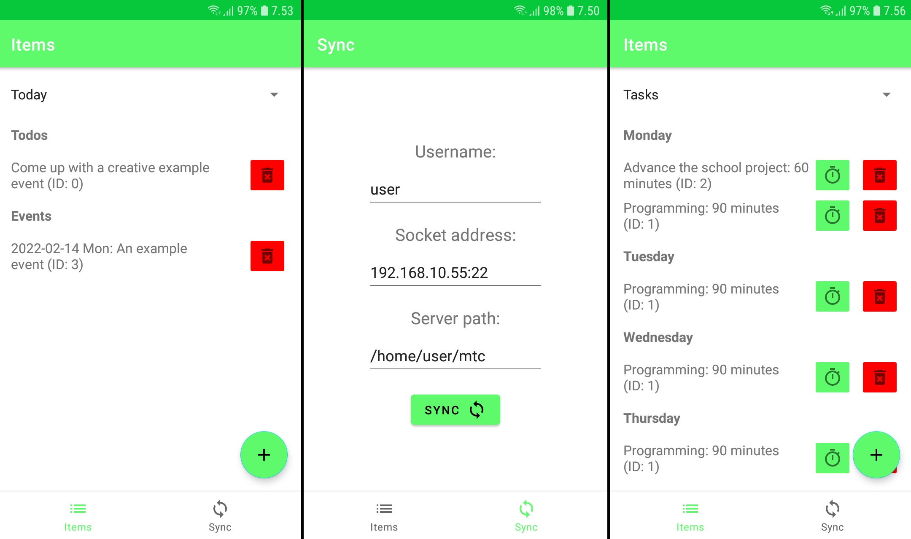

# MTCA - MTC for Android

An Android app for [MTC](https://github.com/Windore/mtc) with the same syncing capabilities. MTCA is
intended to be used alongside MTC. You should use the same version of MTC and MTCA. Using MTCA as a
standalone app is not recommended as MTCA does not support self-syncing or overwriting. MTCA also
doesn't have all the features of MTC such as creating tasks that are for more than a one weekday.
MTCA sends notifications each morning at 7:00 if there are events for that day. 

Reading [MTC README.md](https://github.com/Windore/mtc/blob/master/README.md)
is recommended before using this app.

Note that this app doesn't allow for overwriting and thus you must use the cli app first for writing
to the server to make the initial server files.

## Installation

Download the zip file containing the apk used for installing the app from the 
[releases page](https://github.com/Windore/mtc-android/releases). Make sure that both MTC and MTCA are
the same version.

## License

This project's files are licensed under the [MIT License](LICENSE.md) unless otherwise stated at the
start of a file.
